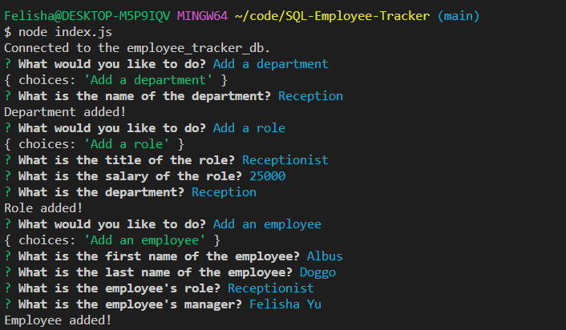
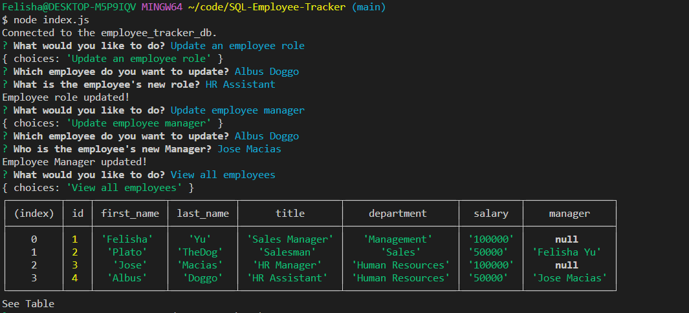

# SQL-Employee-Tracker
Module 12 Challenge

## Table of Contents

- [Description](#description)
- [Installation](#installation)
- [Usage](#usage)
- [Credits](#credits)
- [Features](#features)
- [License](#license)

## Description

A command-line application built from scratch to manage a company's employee database, using Node.js, Inquirer, and MySQL.

### User Story

```md
AS A business owner
I WANT to be able to view and manage the departments, roles, and employees in my company
SO THAT I can organize and plan my business
```

### Acceptance Criteria

```md
GIVEN a command-line application that accepts user input
WHEN I start the application
THEN I am presented with the following options: view all departments, view all roles, view all employees, add a department, add a role, add an employee, and update an employee role
WHEN I choose to view all departments
THEN I am presented with a formatted table showing department names and department ids
WHEN I choose to view all roles
THEN I am presented with the job title, role id, the department that role belongs to, and the salary for that role
WHEN I choose to view all employees
THEN I am presented with a formatted table showing employee data, including employee ids, first names, last names, job titles, departments, salaries, and managers that the employees report to
WHEN I choose to add a department
THEN I am prompted to enter the name of the department and that department is added to the database
WHEN I choose to add a role
THEN I am prompted to enter the name, salary, and department for the role and that role is added to the database
WHEN I choose to add an employee
THEN I am prompted to enter the employee’s first name, last name, role, and manager, and that employee is added to the database
WHEN I choose to update an employee role
THEN I am prompted to select an employee to update and their new role and this information is updated in the database 
```


## Installation

* Clone this repository to your local machine.

* Right click on index.js and select "Open in Integrated Terminal"

* There should be a package.json file included. To install the various npm packages used run the command
```md
npm i
```

## Usage

Update the env.EXAMPLE file name to .env (delete .EXAMPLE from the name) and update with your username and password for MySql.

Once everything is installed and updated with your information, run the following commands to create your database, tables, and put seed information to get started.
```md
mysql - u root -p

<yourpassword>

SOURCE db/schema.sql;

SOURCE db/seeds.sql;

exit
``` 

Run the following command 
```md
node index.js
``` 
Then use arrow keys to navigate through the options. Hit enter and, if applicable, answer the prompts.


See video below for walkthrough.

https://drive.google.com/file/d/1dUM5SJLsQQVuR8Isvv0u-b9a6Z0OuVJ0/view

### Screenshots





## Credits

Inquirer NPM
https://www.npmjs.com/package/inquirer

MySql2
https://www.npmjs.com/package/mysql2

Console.table
https://www.npmjs.com/package/console.table

Concatenate columns from different tables in MySQL
https://www.tutorialspoint.com/concatenate-columns-from-different-tables-in-mysql

## Features

Database schema containing three tables


* `department`

    * `id`: `INT PRIMARY KEY`

    * `name`: `VARCHAR(30)` to hold department name

* `role`

    * `id`: `INT PRIMARY KEY`

    * `title`: `VARCHAR(30)` to hold role title

    * `salary`: `DECIMAL` to hold role salary

    * `department_id`: `INT` to hold reference to department role belongs to

* `employee`

    * `id`: `INT PRIMARY KEY`

    * `first_name`: `VARCHAR(30)` to hold employee first name

    * `last_name`: `VARCHAR(30)` to hold employee last name

    * `role_id`: `INT` to hold reference to employee role

    * `manager_id`: `INT` to hold reference to another employee that is the manager of the current employee (`null` if the employee has no manager)


## License

MIT License

Copyright (c) 2022 Felisha

Permission is hereby granted, free of charge, to any person obtaining a copy
of this software and associated documentation files (the "Software"), to deal
in the Software without restriction, including without limitation the rights
to use, copy, modify, merge, publish, distribute, sublicense, and/or sell
copies of the Software, and to permit persons to whom the Software is
furnished to do so, subject to the following conditions:

The above copyright notice and this permission notice shall be included in all
copies or substantial portions of the Software.

THE SOFTWARE IS PROVIDED "AS IS", WITHOUT WARRANTY OF ANY KIND, EXPRESS OR
IMPLIED, INCLUDING BUT NOT LIMITED TO THE WARRANTIES OF MERCHANTABILITY,
FITNESS FOR A PARTICULAR PURPOSE AND NONINFRINGEMENT. IN NO EVENT SHALL THE
AUTHORS OR COPYRIGHT HOLDERS BE LIABLE FOR ANY CLAIM, DAMAGES OR OTHER
LIABILITY, WHETHER IN AN ACTION OF CONTRACT, TORT OR OTHERWISE, ARISING FROM,
OUT OF OR IN CONNECTION WITH THE SOFTWARE OR THE USE OR OTHER DEALINGS IN THE
SOFTWARE.
